# Flask Docker Application

โปรเจ็กต์ Flask API แบบ RESTful ที่ทำงานใน Docker Container พร้อมด้วย CI/CD Pipeline ผ่าน Jenkins, Github Actions และการแจ้งเตือนผ่าน N8N


## 📋 Table of Contents

- [Flask Docker Application](#flask-docker-application)
  - [📋 Table of Contents](#-table-of-contents)
  - [🚀 Features](#-features)
  - [🏗️ Project Structure](#️-project-structure)
  - [🛠️ Prerequisites](#️-prerequisites)
  - [⚡ Quick Start](#-quick-start)
    - [1. Clone Repository](#1-clone-repository)
    - [2. Local Development](#2-local-development)
    - [3. Docker Development](#3-docker-development)
  - [🐳 Docker Commands](#-docker-commands)
  - [🧪 Testing](#-testing)
  - [🔄 CI/CD Pipeline](#-cicd-pipeline)
  - [⚡ GitHub Actions](#-github-actions)
  - [📡 API Endpoints](#-api-endpoints)
  - [🔧 Configuration](#-configuration)
  - [📝 Environment Variables](#-environment-variables)
  - [🤝 Contributing](#-contributing)
  - [📄 License](#-license)

## 🚀 Features

- ✅ **Flask REST API** - Simple Hello World API endpoint
- 🐳 **Docker Support** - Containerized application for easy deployment
- 🧪 **Unit Testing** - Comprehensive test suite with pytest
- 🔄 **CI/CD Pipeline** - Automated Jenkins pipeline
- ⚡ **GitHub Actions** - Modern CI/CD with GitHub-native automation
- 📊 **Test Reports** - JUnit XML test result reporting
- 📦 **Docker Hub Integration** - Automated image publishing
- 🔔 **N8N Notifications** - Webhook-based notifications
- 🏷️ **Semantic Versioning** - Build number based tagging

## 🏗️ Project Structure

```
flask-docker-app/
├── 📁 tests/                    # Test directory
│   ├── __init__.py             # Test package initializer
│   ├── conftest.py             # Pytest configuration
│   └── test_app.py             # Application tests
├── 📁 __pycache__/             # Python bytecode cache
├── � .github/
│   └── 📁 workflows/
│       └── 📄 main.yml         # GitHub Actions workflow
├── �📄 app.py                   # Main Flask application
├── 🐳 Dockerfile              # Docker build configuration
├── 🔧 Jenkinsfile             # Jenkins CI/CD pipeline
├── ⚙️ pytest.ini              # Pytest configuration
├── 📋 requirements.txt         # Python dependencies
├── 📖 Readme.md               # Project documentation
└── 🚫 .gitignore              # Git ignore rules
```

## 🛠️ Prerequisites

- **Python 3.13+**
- **Docker & Docker Compose**
- **Git**
- **Jenkins** (for CI/CD)
- **N8N** (for notifications, optional)

## ⚡ Quick Start

### 1. Clone Repository

```bash
git clone <repository-url>
cd flask-docker-app
```

### 2. Local Development

```bash
# Install dependencies
pip install -r requirements.txt

# Run the application
python app.py

# Access the API
curl http://localhost:5000/api/hello
```

### 3. Docker Development

```bash
# Build Docker image
docker build -t flask-docker-app .

# Run container
docker run -p 5000:5000 flask-docker-app

# Access the API
curl http://localhost:5000/api/hello
```

## 🐳 Docker Commands

```bash
# Build image with tag
docker build -t iamsamitdev/flask-docker-app:latest .

# Run container in background
docker run -d -p 5000:5000 --name flask-app flask-docker-app

# View logs
docker logs flask-app

# Stop container
docker stop flask-app

# Remove container
docker rm flask-app

# Push to Docker Hub
docker push iamsamitdev/flask-docker-app:latest
```

## 🧪 Testing

```bash
# Install test dependencies
pip install -r requirements.txt

# Run all tests
pytest

# Run tests with verbose output
pytest -v

# Run tests with coverage
pytest --cov=app

# Run specific test
pytest tests/test_app.py::test_hello_endpoint

# Generate XML report (for CI/CD)
pytest --junitxml=test-results.xml
```

### Test Structure

- **Unit Tests**: `tests/test_app.py` - API endpoint testing
- **Configuration**: `pytest.ini` - Test discovery and execution settings
- **Fixtures**: `tests/conftest.py` - Shared test utilities

## 🔄 CI/CD Pipeline

### Jenkins Pipeline Architecture

```mermaid
graph TD
    A[🔍 Checkout] --> B[📦 Install Dependencies]
    B --> C[🧪 Run Tests]
    C --> D{Tests Pass?}
    D -->|❌ No| E[💥 Pipeline Fails]
    D -->|✅ Yes| F[🐳 Build Docker Image]
    F --> G[📤 Push to Docker Hub]
    G --> H[🔔 Send N8N Notification]
    
    E --> I[🚨 Failure Notification]
    
    style A fill:#e1f5fe
    style B fill:#f3e5f5
    style C fill:#fff3e0
    style D fill:#fff9c4
    style E fill:#ffebee
    style F fill:#e8f5e8
    style G fill:#fce4ec
    style H fill:#f1f8e9
    style I fill:#ffebee
```



Jenkins Pipeline stages:

1. **🔍 Checkout** - Pull latest code from repository
2. **📦 Install Dependencies** - Install Python packages
3. **🧪 Test** - Run pytest test suite
4. **🐳 Build** - Create Docker image
5. **📤 Push** - Upload to Docker Hub
6. **🔔 Notify** - Send N8N webhook notification

### Pipeline Features

- ✅ Automated testing on every commit
- 🐳 Docker image building and tagging
- 📊 JUnit test result publishing
- 🔔 Slack/Discord notifications via N8N
- 🏷️ Semantic versioning with build numbers

## ⚡ GitHub Actions

### GitHub Actions Workflow Architecture

```mermaid
graph TD
    A[📝 Push to Main Branch] --> B[🔍 Checkout Code]
    B --> C[🔑 Docker Hub Login]
    C --> D[🐳 Build Docker Image]
    D --> E[📸 Tag with SHA]
    E --> F[📤 Push to Registry]
    F --> G{Build Success?}
    
    G -->|✅ Yes| H[✅ Success Notification to N8N]
    G -->|❌ No| I[❌ Failure Notification to N8N]
    
    J[🌐 GitHub Cloud Runners] -.-> B
    J -.-> C
    J -.-> D
    J -.-> E
    J -.-> F
    
    style A fill:#e3f2fd
    style B fill:#e1f5fe
    style C fill:#f3e5f5
    style D fill:#e8f5e8
    style E fill:#e8eaf6
    style F fill:#fff3e0
    style G fill:#fff9c4
    style H fill:#f1f8e9
    style I fill:#ffebee
    style J fill:#fafafa
```



### Flask-Specific GitHub Actions Pipeline

```mermaid
graph TD
    subgraph "🐍 Python Flask Workflow"
        A1[🔍 Checkout] --> A2[🐍 Setup Python 3.13]
        A2 --> A3[📦 Install Dependencies]
        A3 --> A4[🧪 Run Pytest]
        A4 --> A5{Tests Pass?}
        A5 -->|✅ Yes| A6[📊 Generate Test Report]
        A5 -->|❌ No| A7[💥 Fail Pipeline]
        A6 --> A8[🐳 Build Docker Image]
        A8 --> A9[📤 Push to Hub]
        A9 --> A10[🔔 N8N Webhook]
    end
    
    style A1 fill:#e1f5fe
    style A2 fill:#e8f5e8
    style A3 fill:#f3e5f5
    style A4 fill:#fff3e0
    style A5 fill:#fff9c4
    style A6 fill:#e8eaf6
    style A7 fill:#ffebee
    style A8 fill:#fce4ec
    style A9 fill:#fff3e0
    style A10 fill:#f1f8e9
```



GitHub Actions Workflow สำหรับ CI/CD automation ที่ทำงานแบบ cloud-native:

### Workflow Stages

1. **🔍 Checkout** - Pull latest code from repository
2. **🔑 Docker Hub Login** - Authenticate with container registry
3. **🐳 Build & Push** - Create and upload Docker image with tags
4. **✅ Success Notification** - Send N8N webhook on successful deployment
5. **❌ Failure Notification** - Send N8N webhook on pipeline failure

### Workflow Features

- ✅ **Trigger on Push** - Automatically runs on main branch commits
- 🐳 **Multi-tag Docker Images** - Creates `latest` and commit SHA tags
- 🔔 **N8N Integration** - Webhook notifications for success/failure
- 🔒 **Secure Secrets** - Uses GitHub Secrets for credentials
- ⚡ **Fast Execution** - Cloud-native runners for quick builds
- 🐍 **Python Optimized** - Optimized for Flask Python applications

### GitHub Secrets Configuration

โปรเจ็กต์ใช้ GitHub Secrets สำหรับการจัดการข้อมูลลับ:

| Secret Name | Description | Required |
|-------------|-------------|-----------|
| `DOCKERHUB_USERNAME` | Docker Hub username | ✅ |
| `DOCKERHUB_TOKEN` | Docker Hub access token | ✅ |
| `N8N_WEBHOOK_URL` | N8N webhook endpoint URL | ✅ |

### Setting Up GitHub Secrets

```bash
# Navigate to your GitHub repository
# Go to Settings > Secrets and variables > Actions
# Add the following secrets:

1. DOCKERHUB_USERNAME: your-docker-username
2. DOCKERHUB_TOKEN: your-docker-access-token
3. N8N_WEBHOOK_URL: https://your-n8n-instance.com/webhook/github-actions
```

### Workflow File Structure

```yaml
# .github/workflows/main.yml
name: CI/CD - Flask Docker App

on:
  push:
    branches: [ "main" ]

jobs:
  build-and-push:
    runs-on: ubuntu-latest
    steps:
      - name: Checkout repository
        uses: actions/checkout@v4
      
      - name: Log in to Docker Hub
        uses: docker/login-action@v3
        with:
          username: ${{ secrets.DOCKERHUB_USERNAME }}
          password: ${{ secrets.DOCKERHUB_TOKEN }}
      
      - name: Build and push Docker image
        uses: docker/build-push-action@v5
        with:
          context: .
          push: true
          tags: |
            ${{ secrets.DOCKERHUB_USERNAME }}/my-flask-api:latest
            ${{ secrets.DOCKERHUB_USERNAME }}/my-flask-api:${{ github.sha }}
```

### Flask-Specific Optimizations

GitHub Actions สำหรับ Flask มีการปรับแต่งเฉพาะ:

```yaml
# Optional: Add Python testing step
- name: Set up Python
  uses: actions/setup-python@v4
  with:
    python-version: '3.13'

- name: Install dependencies and test
  run: |
    pip install -r requirements.txt
    pytest --junitxml=test-results.xml

- name: Publish test results
  uses: dorny/test-reporter@v1
  if: success() || failure()
  with:
    name: Pytest Results
    path: test-results.xml
    reporter: java-junit
```

### Webhook Payload Format

GitHub Actions ส่งข้อมูลไปยัง N8N ในรูปแบบ JSON:

**Success Notification:**
```json
{
  "status": "SUCCESS",
  "project": "username/flask-docker-app",
  "commit": "abc123def456",
  "imageUrl": "username/my-flask-api:latest",
  "workflowRunUrl": "https://github.com/username/repo/actions/runs/123456"
}
```

**Failure Notification:**
```json
{
  "status": "FAILED",
  "project": "username/flask-docker-app",
  "commit": "abc123def456",
  "workflowRunUrl": "https://github.com/username/repo/actions/runs/123456"
}
```

### Comparing GitHub Actions vs Jenkins

```mermaid
graph LR
    subgraph "🏢 Jenkins (Self-Hosted)"
        J1[🖥️ Jenkins Server]
        J2[🐍 Python Plugin]
        J3[🐳 Docker Plugin]
        J4[🔧 Groovy Scripts]
        J5[📊 Custom Reports]
        
        J1 --> J2
        J2 --> J3
        J3 --> J4
        J4 --> J5
    end
    
    subgraph "☁️ GitHub Actions (Cloud)"
        G1[🌐 Ubuntu Runners]
        G2[🐍 Python Actions]
        G3[🐳 Docker Actions]
        G4[📄 YAML Config]
        G5[📈 Built-in Reports]
        
        G1 --> G2
        G2 --> G3
        G3 --> G4
        G4 --> G5
    end
    
    subgraph "🔄 Both Support"
        S1[🧪 Pytest Testing]
        S2[🐳 Docker Build]
        S3[📦 Docker Hub Push]
        S4[🔔 N8N Webhooks]
    end
    
    J5 --> S1
    G5 --> S1
    S1 --> S2
    S2 --> S3
    S3 --> S4
    
    style J1 fill:#ffecb3
    style J2 fill:#ffecb3
    style J3 fill:#ffecb3
    style J4 fill:#ffecb3
    style J5 fill:#ffecb3
    
    style G1 fill:#e8f5e8
    style G2 fill:#e8f5e8
    style G3 fill:#e8f5e8
    style G4 fill:#e8f5e8
    style G5 fill:#e8f5e8
    
    style S1 fill:#e3f2fd
    style S2 fill:#e3f2fd
    style S3 fill:#e3f2fd
    style S4 fill:#e3f2fd
```



| Feature | GitHub Actions | Jenkins |
|---------|----------------|---------|
| **Hosting** | Cloud-native (GitHub) | Self-hosted required |
| **Setup** | Minimal YAML configuration | Complex Groovy scripting |
| **Python Support** | Native Python actions | Plugin installation required |
| **Docker Integration** | Built-in Docker support | Docker plugin needed |
| **Pricing** | Free for public repos | Infrastructure costs |
| **Maintenance** | Zero maintenance | Regular updates needed |
| **Integration** | Native GitHub ecosystem | Plugin-based |
| **Secrets Management** | Built-in secure secrets | Credentials plugin |

### Manual Workflow Trigger

```bash
# Trigger workflow manually via GitHub CLI
gh workflow run "CI/CD - Flask Docker App"

# Check workflow status
gh run list --workflow="CI/CD - Flask Docker App"

# View workflow logs
gh run view --log

# Download artifacts (if any)
gh run download
```

### Advanced Configuration

**Matrix Strategy for Multiple Python Versions:**
```yaml
strategy:
  matrix:
    python-version: [3.11, 3.12, 3.13]
steps:
  - uses: actions/setup-python@v4
    with:
      python-version: ${{ matrix.python-version }}
```

**Conditional Deployment:**
```yaml
- name: Deploy to Production
  if: github.ref == 'refs/heads/main' && success()
  run: |
    # Production deployment steps
    echo "Deploying to production..."
```

### Complete CI/CD Pipeline Flow Comparison

```mermaid
graph TB
    subgraph "🔄 Flask CI/CD Pipeline Comparison"
        A[📝 Code Commit] --> B{Choose Pipeline}
        
        B -->|Jenkins| C[🏢 Jenkins Pipeline]
        B -->|GitHub Actions| D[☁️ GitHub Actions]
        
        C --> E[🖥️ Self-hosted Agent]
        E --> F[🐍 Python Environment]
        F --> G[🧪 Pytest Execution]
        G --> H[🐳 Docker Build]
        H --> I[📤 Manual Push]
        I --> J[🔔 N8N Webhook]
        
        D --> K[🌐 Cloud Runners]
        K --> L[🐍 Python Action]
        L --> M[🧪 Pytest Execution]
        M --> N[🐳 Docker Build]
        N --> O[📤 Auto Push]
        O --> P[🔔 N8N Webhook]
        
        J --> Q[📊 Result Dashboard]
        P --> Q
    end
    
    subgraph "🎯 Common Outcomes"
        R[🏷️ Tagged Images]
        S[📋 Test Reports]
        T[🔔 Notifications]
        U[📦 Docker Hub]
    end
    
    Q --> R
    Q --> S
    Q --> T
    Q --> U
    
    style A fill:#e3f2fd
    style C fill:#ffecb3
    style D fill:#e8f5e8
    style E fill:#fff3e0
    style F fill:#e8f5e8
    style G fill:#fff3e0
    style H fill:#f3e5f5
    style I fill:#fce4ec
    style J fill:#f1f8e9
    style K fill:#e1f5fe
    style L fill:#e8f5e8
    style M fill:#fff3e0
    style N fill:#f3e5f5
    style O fill:#fce4ec
    style P fill:#f1f8e9
    style Q fill:#fafafa
    style R fill:#e8eaf6
    style S fill:#e8eaf6
    style T fill:#e8eaf6
    style U fill:#e8eaf6
```



## 📡 API Endpoints

| Method | Endpoint | Description | Response |
|--------|----------|-------------|-----------|
| `GET` | `/api/hello` | Hello World endpoint | `{"message": "Hello from Flask API!"}` |

### Example Requests

```bash
# Get hello message
curl -X GET http://localhost:5000/api/hello

# Response
{
  "message": "Hello from Flask API!"
}
```

## 🔧 Configuration

### Flask Configuration

```python
# app.py
app.run(host='0.0.0.0', port=5000)
```

### Docker Configuration

```dockerfile
# Dockerfile
FROM python:3.13-slim
WORKDIR /app
EXPOSE 5000
CMD ["python", "app.py"]
```

### Test Configuration

```ini
# pytest.ini
[tool:pytest]
testpaths = tests
python_files = test_*.py
addopts = -v --tb=short
```

## 📝 Environment Variables

### Jenkins Pipeline Variables

| Variable | Description | Default |
|----------|-------------|---------|
| `DOCKERHUB_CREDENTIALS` | Docker Hub login credentials | `dockerhub-credentials` |
| `N8N_WEBHOOK_URL_CREDENTIALS` | N8N webhook URL | `n8n-webhook-url` |
| `DOCKER_IMAGE_NAME` | Docker image name | `iamsamitdev/flask-docker-app` |
| `DOCKER_IMAGE_TAG` | Image tag | `${BUILD_NUMBER}` |

### Runtime Environment

| Variable | Description | Default |
|----------|-------------|---------|
| `FLASK_ENV` | Flask environment | `production` |
| `FLASK_DEBUG` | Debug mode | `False` |
| `PORT` | Application port | `5000` |

## 🤝 Contributing

1. **Fork** the repository
2. **Create** a feature branch (`git checkout -b feature/amazing-feature`)
3. **Commit** your changes (`git commit -m 'Add some amazing feature'`)
4. **Push** to the branch (`git push origin feature/amazing-feature`)
5. **Open** a Pull Request

### Development Workflow

```bash
# Setup development environment
python -m venv venv
source venv/bin/activate  # On Windows: venv\Scripts\activate
pip install -r requirements.txt

# Run tests before committing
pytest

# Format code (optional)
black app.py tests/

# Lint code (optional)
flake8 app.py tests/
```

## 📄 License

This project is licensed under the MIT License - see the [LICENSE](LICENSE) file for details.

---

**📞 Contact Information:**

- **Developer**: Samit
- **Docker Hub**: [iamsamitdev](https://hub.docker.com/u/iamsamitdev)
- **Project**: Flask Docker App Training Workshop

**🔗 Related Projects:**

- [Express Docker App](../express-docker-app)
- [Spring Boot Docker App](../springboot-docker-app)

**📚 Technology Stack:**

- **Language**: Python 3.13+
- **Framework**: Flask 3.0.3
- **Testing**: Pytest with Flask integration
- **Containerization**: Docker (Python slim image)
- **CI/CD**: Jenkins Pipeline + GitHub Actions
- **Automation**: N8N Webhooks

**🎯 Learning Objectives:**

- Understanding Flask framework fundamentals
- Python containerization best practices
- Pytest testing framework and API testing
- CI/CD pipeline implementation with Jenkins
- GitHub Actions workflow automation
- N8N webhook integration and notifications
- Automated deployment strategies
- Comparing traditional CI/CD vs cloud-native approaches

---

*Built with ❤️ for DevOps Training Workshop*